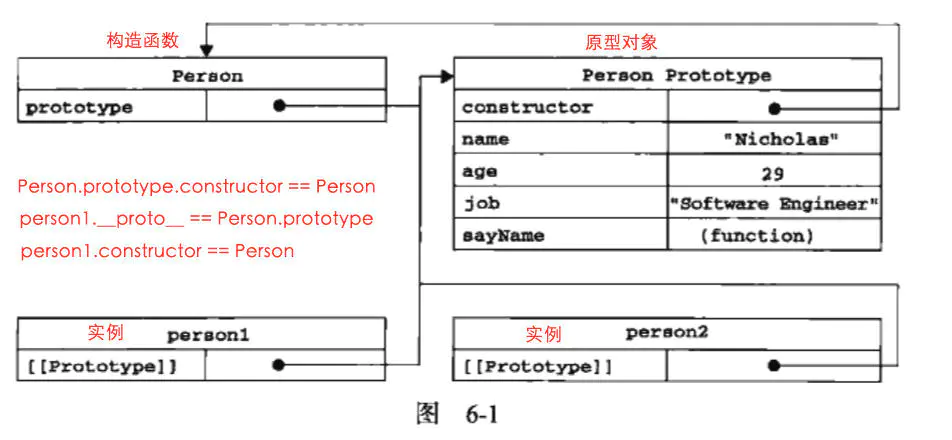
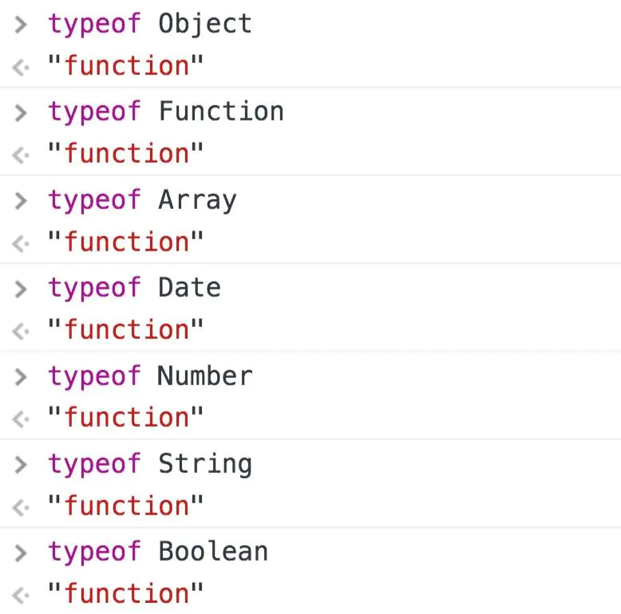

# 一、普通对象和函数对象
JS中，万物皆对象。但对象也是有区别的，分为**普通对象**和**函数对象**，Object和Function是JS自带的函数对象
```javascript
var o1 = {};
var o2 = new Object();
var o3 = new f1();

function f1(){};
var f2 = function(){};
var f3 = new Function('str','console.log(str)');

console.log(typeof Object); //function 
console.log(typeof Function); //function  

console.log(typeof f1); //function 
console.log(typeof f2); //function 
console.log(typeof f3); //function   

console.log(typeof o1); //object 
console.log(typeof o2); //object 
console.log(typeof o3); //object
```
在上面的例子中，`o1` `o2` `o3`是普通对象，`f1` `f2` `f3`是函数对象。
**凡是通过new Function() / function Object()创建的对象都是函数对象，**
其他的都是普通对象

# 二、构造函数
```javascript
function Person (name, age, job) {
  this.name = name
  this.age = age
  this.job = job
  this.sayName =  function() { alert(this.name) }
}
var person1 = new Person('Zaxlct', 28, 'Software Engineer')
var person2 = new Person('Mick', 23, 'Doctor')
```
上面的例子中，`person1`、`person2`都是`Person`的实例，这两个实例都有一个`constructor`(构造函数)属性，该属性（是一个指针）指向`Person`，即：
```javascript
console.log(person1.constructor === Person)
console.log(person2.constructor === Person)
```
我们要记住两个概念（构造函数，实例）：  
**`person1` 和 `person2` 都是 构造函数 `Person` 的实例**  
一个公式：
**实例的构造函数属性（constructor）指向构造函数。**

# 三、原型对象
在 JavaScript 中，每当定义一个对象（函数也是对象）时候，对象中都会包含一些预定义的属性。
其中每个**函数对象**都有一个 `prototype` 属性，这个属性指向函数的**原型对象**
```javascript
function Person () {
  Person.prototype.name = 'Zaxlct'
  Person.prototype.age = 22
  Person.prototype.job = 'Software Engineer'
  Person.prototype.sayName = function () {
    alert(this.name)
  }
}
var person1 = new Person();
person1.sayName(); // 'Zaxlct'

var person2 = new Person();
person2.sayName(); // 'Zaxlct'

console.log(person1.sayName == person2.sayName); //true
```
**结论：每个对象都有__proto__属性，但只有函数对象才有prototype属性**
______
什么是**原型对象**呢？
```javascript
Person.prototype = {
   name: 'Zaxlct',
   age: 28,
   job: 'Software Engineer',
   sayName: function() {
     alert(this.name);
   }
}
```
原型对象，就是一个**普通对象**(Function.prototype除外)。  
这个普通对象除了`name`,`age`,`job`,`sayName`属性之外，还会自动获得`constructor`属性，这个属性指向prototype属性所在的函数: `Person.prototype.constructor == Person`
```javascript
person1.constructor == Person
Person.prototype.constructor == Person
```
`Person.prototype`也是`Person`的实例， Person 创建的时候，创建了一个它的实例对象并赋值给它的 prototype  
**结论：原型对象（Person.prototype）是 构造函数（Person）的一个实例**
______
原型对象其实就是普通对象（但 `Function.prototype` 除外，它是函数对象，但它很特殊，他没有`prototype`属性（前面说道函数对象都有`prototype`属性））。看下面的例子：
```javascript
 function Person(){};
 console.log(Person.prototype) //Person{}
 console.log(typeof Person.prototype) //Object
 console.log(typeof Function.prototype) // Function，这个特殊
 console.log(typeof Object.prototype) // Object
 console.log(typeof Function.prototype.prototype) //undefined
```
Function.prototype是Function的实例对象，即`Function.prototype = new Function ()`，所以是函数对象
______
原型对象的作用是**实现继承**
```javascript
const Person = function (name) {
  this.name = name
}
Person.prototype.getName = function () {
  return this.name
}
let person1 = new Person('Mick')
person1.getName()
```
通过给 `Person.prototype` 设置了一个函数对象的属性，`Person` 的实例化对象继承了这个属性。具体是怎么实现的继承，就要讲到下面的原型链了

# 四、\__proto\__
JS 在创建对象（不论是普通对象还是函数对象）的时候，都有一个叫做`__proto__` 的内置属性，用于指向创建它的构造函数的原型对象。  
对象 `person1` 有一个 `__proto__`属性，创建它的构造函数是 `Person`，构造函数的原型对象是 `Person.prototype`，所以：  
`person1.__proto__ == Person.prototype`

```javascript
Person.prototype.constructor == Person;
person1.__proto__ == Person.prototype;
person1.constructor == Person;
```

# 五、构造器
构造器就是构造函数，都是函数对象
```javascript
var b = new Array();
b.constructor === Array;
b.__proto__ === Array.prototype;

var c = new Date(); 
c.constructor === Date;
c.__proto__ === Date.prototype;

var d = new Function();
d.constructor === Function;
d.__proto__ === Function.prototype;
```
以下都是构造器：


# 六、原型链
小测试来检验一下你理解的怎么样：

1. `person1.__proto__` 是什么？
2. `Person.__proto__` 是什么？
3. `Person.prototype.__proto__` 是什么？
4. `Object.__proto__` 是什么？
5. `Object.prototype__proto__` 是什么？

答案：  
第一题：
因为 person1.__proto__ === person1 的构造函数.prototype
因为 person1的构造函数 === Person
所以 person1.__proto__ === Person.prototype

第二题：
因为 Person.__proto__ === Person的构造函数.prototype
因为 Person的构造函数 === Function
所以 Person.__proto__ === Function.prototype

第三题：
Person.prototype 是一个普通对象，我们无需关注它有哪些属性，只要记住它是一个普通对象。
因为一个普通对象的构造函数 === Object
所以 Person.prototype.__proto__ === Object.prototype

第四题：
参照第二题，因为 Person 和 Object 一样都是构造函数

第五题：
Object.prototype 对象也有proto属性，但它比较特殊，为 null 。 因为 null 处于原型链的顶端，这个只能记住。
**Object.prototype.__proto__ === null**

# 七、函数对象
所有函数对象的`proto`都指向`Function.prototype`，它是一个空函数（Empty function）
```javascript
Number.__proto__ === Function.prototype  // true
Number.constructor == Function //true

Boolean.__proto__ === Function.prototype // true
Boolean.constructor == Function //true

String.__proto__ === Function.prototype  // true
String.constructor == Function //true

// 所有的构造器都来自于Function.prototype，甚至包括根构造器Object及Function自身
Object.__proto__ === Function.prototype  // true
Object.constructor == Function // true

// 所有的构造器都来自于Function.prototype，甚至包括根构造器Object及Function自身
Function.__proto__ === Function.prototype // true
Function.constructor == Function //true

Array.__proto__ === Function.prototype   // true
Array.constructor == Function //true

RegExp.__proto__ === Function.prototype  // true
RegExp.constructor == Function //true

Error.__proto__ === Function.prototype   // true
Error.constructor == Function //true

Date.__proto__ === Function.prototype    // true
Date.constructor == Function //true
```
JavaScript中有内置(build-in)构造器/对象共计12个（ES5中新加了JSON），这里列举了可访问的8个构造器。剩下如Global不能直接访问，Arguments仅在函数调用时由JS引擎创建，Math，JSON是以对象形式存在的，无需new。它们的proto是Object.prototype。如下

```javascript
Math.__proto__ === Object.prototype  // true
Math.construrctor == Object // true

JSON.__proto__ === Object.prototype  // true
JSON.construrctor == Object //true
```
上面说的函数对象当然包括自定义的。如下
```javascript
// 函数声明
function Person() {}
// 函数表达式
var Man = function() {}
console.log(Person.__proto__ === Function.prototype) // true
console.log(Man.__proto__ === Function.prototype)    // true
```
**所有的构造器都来自 `Function.prototype`，甚至包括根构造器`Object`及`Function`自身。所有构造器都继承了`Function.prototype`的属性及方法。如`length、call、apply、bind`**

# 八、prototype


## 参考
https://www.jianshu.com/p/dee9f8b14771  
https://www.jianshu.com/p/652991a67186  
https://www.jianshu.com/p/a4e1e7b6f4f8


