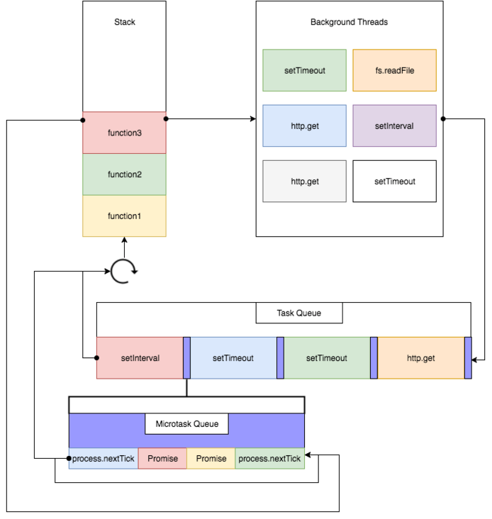
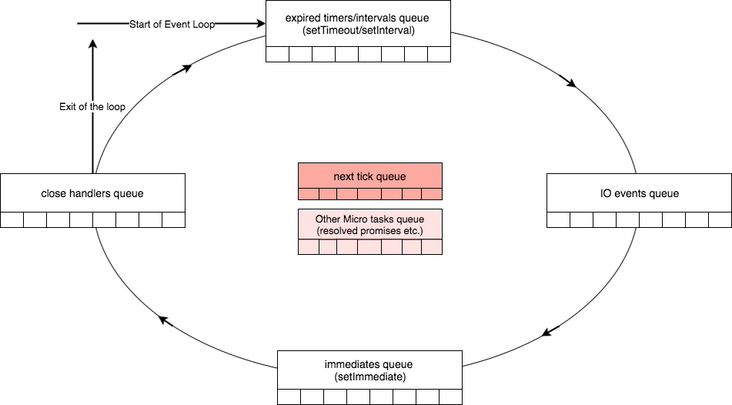
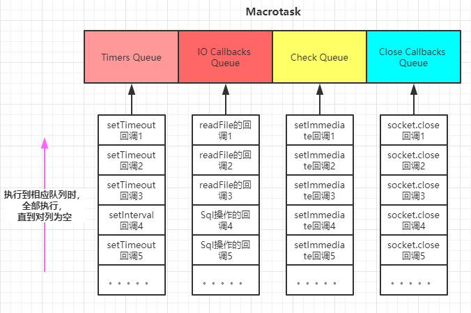

### 概述
event loop是一个执行模型，在不同的地方有不同的实现。浏览器和NodeJS基于不同的技术实现了各自的Event Loop

### 宏队列
宏队列，macrotask，也叫tasks。 一些异步任务的回调会依次进入macro task queue，等待后续被调用，这些异步任务包括：
 - setTimeout
 - setInterval
 - setImmediate (Node独有)
 - requestAnimationFrame (浏览器独有)
 - I/O
 - UI rendering (浏览器独有)

### 微队列
微队列，microtask，也叫jobs。 另一些异步任务的回调会依次进入micro task queue，等待后续被调用，这些异步任务包括：
 - process.nextTick (Node独有)
 - Promise
 - Object.observe
 - MutationObserver

### 浏览器事件循环


### 执行步骤
1. 执行全局Script同步代码，这些同步代码有一些是同步语句，有一些是异步语句（比如setTimeout等）；
2. 全局Script代码执行完毕后，调用栈Stack会清空；
3. 从微队列microtask queue中取出位于队首的回调任务，放入调用栈Stack中执行，执行完后microtask queue长度减1；
4. 继续取出位于队首的任务，放入调用栈Stack中执行，以此类推，直到直到把microtask queue中的所有任务都执行完毕。注意，如果在执行microtask的过程中，又产生了microtask，那么会加入到队列的末尾，也会在这个周期被调用执行；
5. microtask queue中的所有任务都执行完毕，此时microtask queue为空队列，调用栈Stack也为空；
6. 取出宏队列macrotask queue中位于队首的任务，放入Stack中执行；
7. 执行完毕后，调用栈Stack为空；
8. 重复第3-7个步骤；直至微队列和宏队列均为空

### 重点
1. 宏队列macrotask一次只从队列中取一个任务执行，执行完后就去执行微任务队列中的任务；
2. 微任务队列中所有的任务都会被依次取出来执行，知道microtask queue为空；
3. 图中没有画UI rendering的节点，因为这个是由浏览器自行判断决定的，但是只要执行UI rendering，它的节点是在执行完所有的microtask之后，下一个macrotask之前，紧跟着执行UI render。

### 实例分析
```
console.log(1);

setTimeout(() => {
  console.log(2);
  Promise.resolve().then(() => {
    console.log(3)
  });
});

new Promise((resolve, reject) => {
  console.log(4)
  resolve(5)
}).then((data) => {
  console.log(data);
})

setTimeout(() => {
  console.log(6);
})

console.log(7);
```

 1. 执行全局Script代码
```
console.log(1);              // 同步执行

setTimeout(() => {           // 宏任务1
  console.log(2);
  Promise.resolve().then(() => {  // 微任务1
    console.log(3)
  });
});

new Promise((resolve, reject) => {  // 同步执行
  console.log(4)
  resolve(5)
}).then((data) => {  // 微任务2
  console.log(data);
})

setTimeout(() => {  // 宏任务2
  console.log(6);
})

console.log(7);  // 同步执行
```
- 执行结果  
> 1  
> 4  
> 7  
- 任务序列
> 宏序列: [宏任务1, 宏任务2]  
> 微序列: [微任务2]
***

2. 执行微序列中的所有微任务  
```
resolve(5)
.then((data) => {  // 微任务2
  console.log(data);
})
```
- 执行结果  
> 1  
> 4  
> 7  
> 5  
- 任务序列
> 宏序列: [宏任务1, 宏任务2]  
> 微序列: []
***

3. 执行宏序列中的队首宏任务
```
setTimeout(() => {           // 宏任务1
  console.log(2);
  Promise.resolve().then(() => {  // 微任务1
    console.log(3)
  });
});
```
- 执行结果  
> 1  
> 4  
> 7  
> 5  
> 2  
- 任务序列
> 宏序列: [宏任务2]  
> 微序列: [微任务1]

**因为有微任务产生，再去执行微任务**
```
Promise.resolve().then(() => {  // 微任务1
    console.log(3)
  });
```
- 执行结果  
> 1  
> 4  
> 7  
> 5  
> 2  
> 3
- 任务序列
> 宏序列: [宏任务2]  
> 微序列: []
***
4. 执行队首宏任务

```
setTimeout(() => {  // 宏任务2
  console.log(6);
})
```
- 执行结果  
> 1  
> 4  
> 7  
> 5  
> 2  
> 3  
> 6
- 任务序列
> 宏序列: []  
> 微序列: []

**在执行微队列microtask queue中任务的时候，如果又产生了microtask，那么会继续添加到队列的末尾，也会在这个周期执行，直到microtask queue为空停止**


## NodeJS中的Event Loop
### NodeJS执行宏队列任务的六个阶段


#### 各个阶段执行的任务如下：

 - timers阶段：这个阶段执行setTimeout和setInterval预定的callback
 - I/O callback阶段：执行除了close事件的callbacks、被timers设定的callbacks、setImmediate()设定的callbacks这些之外的callbacks
 - idle, prepare阶段：仅node内部使用
 - poll阶段：获取新的I/O事件，适当的条件下node将阻塞在这里
 - check阶段：执行setImmediate()设定的callbacks
 - close callbacks阶段：执行socket.on('close', ....)这些callbacks

#### 宏队列
1. Timers Queue
2. IO Callbacks Queue
3. Check Queue
4. Close Callbacks Queue

#### 微队列
1. Next Tick Queue：是放置process.nextTick(callback)的回调任务的
2. Other Micro Queue：放置其他microtask，比如Promise等

### NodeJS事件循环


### 执行步骤
1. 执行全局Script的同步代码
2. 执行microtask微任务，先执行所有Next Tick Queue中的所有任务，再执行Other Microtask Queue中的所有任务
3. 开始执行macrotask宏任务，共6个阶段，从第1个阶段开始执行相应每一个阶段macrotask中的所有任务，注意，这里是所有每个阶段宏任务队列的所有任务，在浏览器的Event Loop中是只取宏队列的第一个任务出来执行，每一个阶段的macrotask任务执行完毕后，开始执行微任务，也就是步骤2
4. Timers Queue -> 步骤2 -> I/O Queue -> 步骤2 -> Check Queue -> 步骤2 -> Close Callback Queue -> 步骤2 -> Timers Queue ......




### 实例说明
```
console.log('start');

setTimeout(() => {          // timer1
  console.log(111);
  setTimeout(() => {        // timer2
    console.log(222);
  }, 0);
  setImmediate(() => {      // check1
    console.log(333);
  })
  process.nextTick(() => {  // micro-nexttick1
    console.log(444);  
  })
}, 0);

setImmediate(() => {        // check2
  console.log(555);
  process.nextTick(() => {  // micro-nexttick2
    console.log(666);  
  })
})

setTimeout(() => {          // timer3              
  console.log(777);
  process.nextTick(() => {  // micro-nexttick3
    console.log(888);   
  })
}, 0);

process.nextTick(() => {    // micro-nexttick4
  console.log(999);  
})

console.log('end');
```
#### 执行步骤
1. 同步script代码
> Console: start, end  
> Timers Queue: [timer1,timer3]  
> Check Queue: [check2]  
> Next Tick Queue: [nexttick4]
2. 执行微任务 nexttick4
> Console: start, end, 999  
> Timers Queue: [timer1,timer3]  
> Check Queue: [check2]  
> Next Tick Queue: []
3. 执行Timers Queue中的所有宏任务
> Console: start, end, 999, 111, 777  
> Timers Queue: [timer2]  
> Check Queue: [check2,check1]  
> Next Tick Queue: [nexttick1,nexttick3]
4. 执行微任务 nexttick1,nexttick3
> Console: start, end, 999, 111, 777, 444, 888  
> Timers Queue: [timer2]  
> Check Queue: [check2,check1]  
> Next Tick Queue: []
5. 执行Check Queue中的所有宏任务
> Console: start, end, 999, 111, 777, 444, 888, 555, 333  
> Timers Queue: [timer2]  
> Check Queue: []  
> Next Tick Queue: [nexttick2]
6. 执行微任务 nexttick2
> Console: start, end, 999, 111, 777, 444, 888, 555, 333, 666  
> Timers Queue: [timer2]  
> Check Queue: []  
> Next Tick Queue: []
7. 执行Timers Queue中的所有宏任务
> Console: start, end, 999, 111, 777, 444, 888, 555, 333, 666, 222  
> Timers Queue: []  
> Check Queue: []  
> Next Tick Queue: []
8. 宏序列微序列为空，执行完毕

### 总结
1. 浏览器的Event Loop和NodeJS的Event Loop是不同的，实现机制也不一样，不要混为一谈。
2. 浏览器可以理解成只有1个宏任务队列和1个微任务队列，先执行全局Script代码，执行完同步代码调用栈清空后，从微任务队列中依次取出所有的任务放入调用栈执行，微任务队列清空后，从宏任务队列中只取位于队首的任务放入调用栈执行，注意这里和Node的区别，只取一个，然后继续执行微队列中的所有任务，再去宏队列取一个，以此构成事件循环。
3. NodeJS可以理解成有4个宏任务队列和2个微任务队列，但是执行宏任务时有6个阶段。先执行全局Script代码，执行完同步代码调用栈清空后，先从微任务队列Next Tick Queue中依次取出所有的任务放入调用栈中执行，再从微任务队列Other Microtask Queue中依次取出所有的任务放入调用栈中执行。~~然后开始宏任务的6个阶段，每个阶段都将该宏任务队列中的所有任务都取出来执行（注意，这里和浏览器不一样，浏览器只取一个），每个宏任务阶段执行完毕后，开始执行微任务，再开始执行下一阶段宏任务，以此构成事件循环。~~ Node 在新版本中，也是每个 Macrotask 执行完后，就去执行 Microtask 了，和浏览器的模型一致。
4. MacroTask包括： setTimeout、setInterval、 setImmediate(Node)、requestAnimation(浏览器)、IO、UI rendering
5. Microtask包括： process.nextTick(Node)、Promise、Object.observe、MutationObserver

