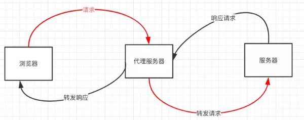

**跨域问题出自浏览器的同源策略限制**

### 同源策略
 - 两个页面具有相同的协议（protocol），主机（host）和端口号（port）
 - 当一个请求url的协议、域名、端口三者之间任意一个与当前页面url不同即为跨域

### 非同源限制
1. 无法读取非同源网页的 Cookie、LocalStorage 和 IndexedDB
2. 无法接触非同源网页的 DOM
3. 无法向非同源地址发送 AJAX 请求

### 跨域解决方法
1. 设置document.domain解决无法读取非同源网页的 Cookie 问题  
参考链接：
https://blog.csdn.net/nlznlz/article/details/79506655

2. 跨文档通信 API：window.postMessage()  
调用postMessage方法实现父窗口 http://test1.com 向子窗口 http://test2.com 发消息（子窗口同样可以通过该方法发送消息给父窗口）
它可用于解决以下方面的问题：
> 页面和其打开的新窗口的数据传递  
> 多窗口之间消息传递  
> 页面与嵌套的iframe消息传递  
> 上面三个场景的跨域数据传递
```
// 父窗口打开一个子窗口
var openWindow = window.open('http://test2.com', 'title');
 
// 父窗口向子窗口发消息(第一个参数代表发送的内容，第二个参数代表接收消息窗口的url)
openWindow.postMessage('Nice to meet you!', 'http://test2.com');
```
> 调用message事件，监听对方发送的消息
```
// 监听 message 消息
window.addEventListener('message', function (e) {
  console.log(e.source); // e.source 发送消息的窗口
  console.log(e.origin); // e.origin 消息发向的网址
  console.log(e.data);   // e.data   发送的消息
},false);
```

3. JSONP  
JSONP 是服务器与客户端跨源通信的常用方法。最大特点就是简单适用，兼容性好（兼容低版本IE），缺点是只支持get请求，不支持post请求。  
核心思想：网页通过添加一个\<script\>元素，向服务器请求 JSON 数据，服务器收到请求后，将数据放在一个指定名字的回调函数的参数位置传回来。
```
// 原生实现
<script src="http://test.com/data.php?callback=dosomething"></script>
// 向服务器test.com发出请求，请求的查询字符串有一个callback参数，来指定回调函数的名字
 
// 处理服务器返回回调函数的数据
<script type="text/javascript">
    function dosomething(res){
        // 处理获得的数据
        console.log(res.data)
    }
</script>
```
```
// jQuery ajax
$.ajax({
    url: 'http://www.test.com:8080/login',
    type: 'get',
    dataType: 'jsonp',  // 请求方式为jsonp
    jsonpCallback: "handleCallback",    // 自定义回调函数名
    data: {}
});
```
```
// vue
this.$http.jsonp('http://www.domain2.com:8080/login', {
    params: {},
    jsonp: 'handleCallback'
}).then((res) => {
    console.log(res); 
})
```
参考链接： https://www.cnblogs.com/chiangchou/p/jsonp.html

4. CORS  
 - CORS 是一个 W3C 标准，全称是“跨域资源共享”（Cross-origin resource sharing）。它允许浏览器向跨域的服务器，发出XMLHttpRequest请求，从而克服了AJAX只能同源使用的限制  
 - CORS 需要浏览器和服务器同时支持
 - 整个 CORS 通信过程，都是浏览器自动完成，不需要用户参与。对于开发者来说，CORS 通信与普通的 AJAX 通信没有差别，代码完全一样。浏览器一旦发现 AJAX 请求跨域，就会自动添加一些附加的头信息，有时还会多出一次附加的请求，但用户不会有感知。因此，实现 CORS 通信的关键是服务器。只要服务器实现了 CORS 接口，就可以跨域通信
 - CORS 请求分成两类：简单请求（simple request）和非简单请求（not-so-simple request）
 - 只要同时满足以下两大条件，就属于简单请求。
 > （1）请求方法是以下三种方法之一。  
 >>     HEAD  
 >>     GET  
 >>     POST  
 > （2）HTTP 的头信息不超出以下几种字段。
 >>       Accept
 >>       Accept-Language
 >>       Content-Language
 >>       Last-Event-ID
 >>       Content-Type：只限于三个值 - application/x-www-form-urlencoded、multipart/form-data、text/plain
凡是不同时满足上面两个条件，就属于非简单请求。一句话，简单请求就是简单的 HTTP 方法与简单的 HTTP 头信息的结合。

参考链接：https://blog.csdn.net/qq_40437152/article/details/89000525

5. Webpack本地代理

```
    devServer: {
        port: 8080,
        proxy: {
            "/api": {
              target: "http://192.168.25.20:8088" // 后端接口
            }
        }
    }
```

6. websocket  
  Websocket 是 HTML5 的一个持久化的协议，它实现了浏览器与服务器的全双工通信，同时也是跨域的一种解决方案。WebSocket 和 HTTP 都是应用层协议，都基于 TCP 协议。但是 WebSocket 是一种双向通信协议，在建立连接之后，WebSocket 的 服务器与 客户端都能主动向对方发送或接收数据。同时，WebSocket 在建立连接时需要借助 HTTP 协议，连接建立好了之后 client 与 server 之间的双向通信就与 HTTP 无关了

7. Nginx反向代理  
  实现原理类似于 Node 中间件代理，需要你搭建一个中转 nginx 服务器，用于转发请求。  
  使用 nginx 反向代理实现跨域，是最简单的跨域方式。只需要修改 nginx 的配置即可解决跨域问题，支持所有浏览器，支持 session，不需要修改任何代码，并且不会影响服务器性能。  
  我们只需要配置nginx，在一个服务器上配置多个前缀来转发http/https请求到多个真实的服务器即可。这样，这个服务器上所有url都是相同的域 名、协议和端口。因此，对于浏览器来说，这些url都是同源的，没有跨域限制。而实际上，这些url实际上由物理服务器提供服务。这些服务器内的 javascript可以跨域调用所有这些服务器上的url。

